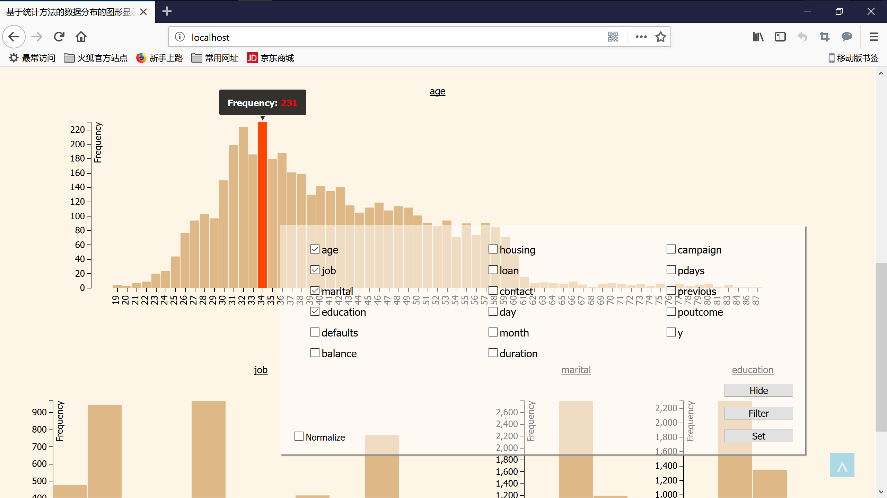
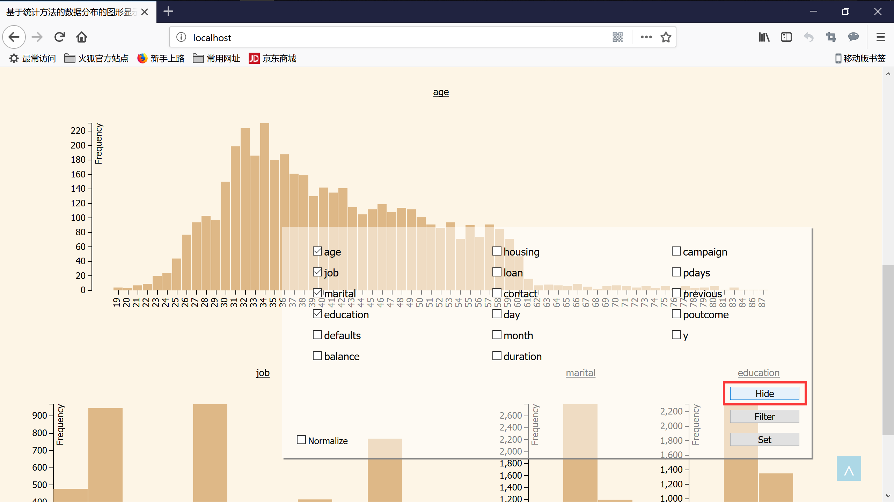
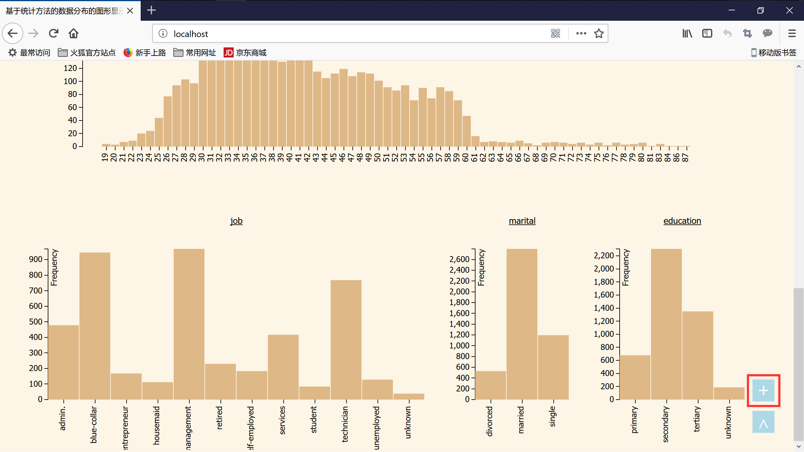
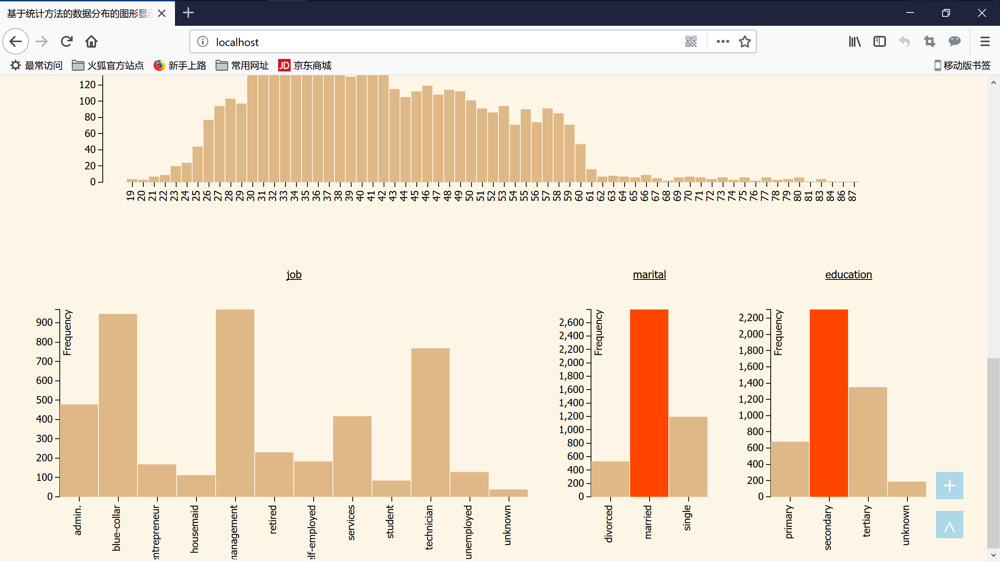
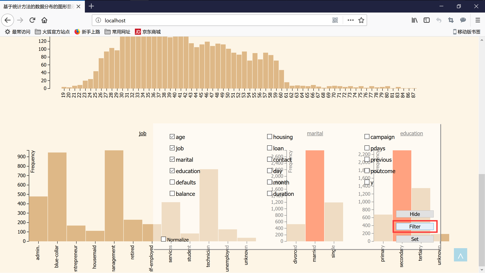

# DATABASE VISUALIZATION

## Requirements

Apache2 + Mysql + Php

To install apache2:

```bash
sudo apt-get install apache2
```

To install mysql:

```bash
sudo apt-get install mysql-server mysql-client
```

To install php:

```bash
sudo apt-get install php
```

To link php with apache2(LAMP):

```bash
sudo apt-get install libapache2-mod-php
```

To link php with mysql:

```bash
sudo apt-get install php-mysql
```

## Usage

Download zip or git clone the whole package:

```bash
git clone git@github.com:Sylfii/toys.git
```

Then copy all the files into /var/www/html:

```bash
sudo cp $YOUR_PATH$/toys/* /var/www/html
```

\$YOUR_PATH\$ is where you put the directory 'toys'.

Start apache2 & mysql:

```bash
sudo service apache2 start
sudo service mysql start
```

Then everything is ready.

Use your browser to open localhost/ , and you will see:


Follow the instruction, after upload a csv file:


Tick checkboxes interested, and click button 'Set':


Then it will look like:



Tick checkbox 'Normalize' and click button 'Set' again:


The charts will be normalized:


Click button 'Hide' to hide this panel:



Click button '+' to show this panel:



Click button '^' to scroll back to top:


Select the filter condition:



Then Click button 'Filter':



It works:


Of course you can click 'Filter' without condition to reset.

At last, you can click '^' and back to top to upload another csv file.


That's all, thanks XD.